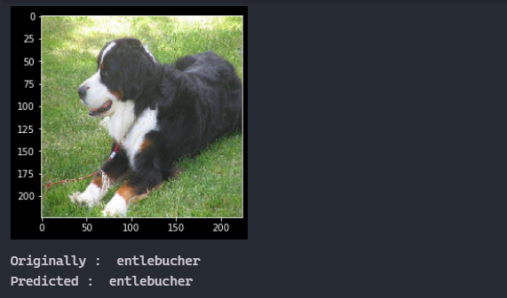

# Köpek Türü Tahmini

  - Bu projede, bir CNN oluşturmak, eğitmek ve test etmek için TensorFlow ve Keras kullanarak bir köpek cinsini tahmin etmek için bir yapay sinir ağı geliştirdim.

## Proje oluşturma adımları:

1-Kaggle'dan veri kümesini yükleyin. ÖNEMLİ Buradan Veri Kümesini İndir BOYUT: 750MB

2-Etiketleri, görüntü kimliği ve cins içeren CSV dosyasından yükleyin.

3-Cins sayısını kontrol edin.

4-Etiket verilerindeki "PREDICTION" sütununda ONE-HOT encoding uygulayın.

5-Görüntüleri yükleyin, diziye dönüştürün ve normalize edin.

6-X ve Y Verilerinin şeklini ve boyutunu kontrol edin.

7-Model Ağı Mimarisi oluşturma.

8-Veriyi bölmek ve model içine yerleştirmek, yeni doğruluk puanı oluşturmak.

9-Modeli doğruluk skoru için değerlendirin.

10-Modeli tahmin yapmak için kullanın.

NOT: Eğer Anaconda yüklüyse, requirements.txt dosyasına ihtiyaç duymazsınız çünkü anaconda önceden yüklenmiş paketlerle gelir.

NOT: Bu proje bilgisayarınıza bağlı olarak yaklaşık 1 saat sürebilir.

### Doğruluk Grafiği

### Output

